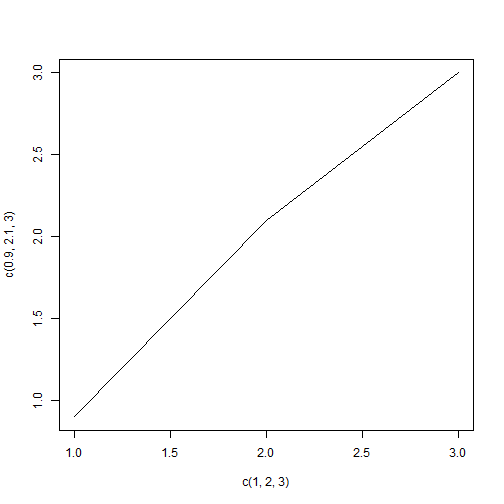

MDlearning ExampleNo02
============================
Notepad能不能Compile呢
----------------------------

```r
a = runif(1)
if (a > 0.5) {
    print("Yes")
} else {
    print("No")
}
```

```
## [1] "Yes"
```

如果大括号里不止“r”呢
----------------------------

```r
print("hiahiahia")
```

```
## [1] "hiahiahia"
```

画图
----------------------------

```r
plot(c(1, 2, 3), c(0.9, 2.1, 3), type = "l")
```

 

